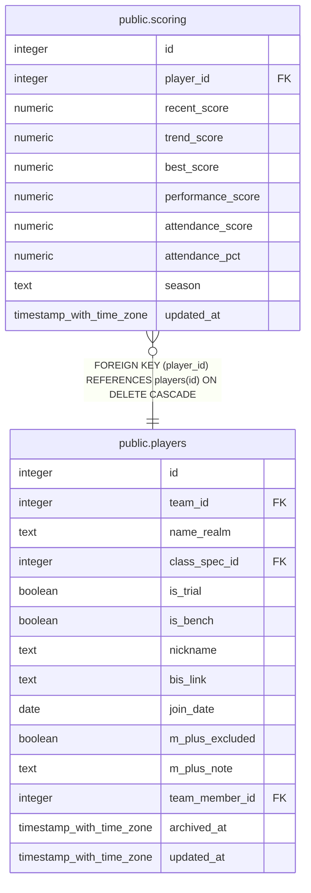

# public.scoring

## Columns

| Name | Type | Default | Nullable | Children | Parents | Comment |
| ---- | ---- | ------- | -------- | -------- | ------- | ------- |
| id | integer | nextval('scoring_id_seq'::regclass) | false |  |  |  |
| player_id | integer |  | false |  | [public.players](public.players.md) |  |
| recent_score | numeric |  | true |  |  |  |
| trend_score | numeric |  | true |  |  |  |
| best_score | numeric |  | true |  |  |  |
| performance_score | numeric |  | true |  |  |  |
| attendance_score | numeric |  | true |  |  |  |
| attendance_pct | numeric |  | true |  |  |  |
| season | text |  | false |  |  |  |
| updated_at | timestamp with time zone |  | true |  |  |  |

## Constraints

| Name | Type | Definition |
| ---- | ---- | ---------- |
| scoring_player_id_fkey | FOREIGN KEY | FOREIGN KEY (player_id) REFERENCES players(id) ON DELETE CASCADE |
| scoring_pkey | PRIMARY KEY | PRIMARY KEY (id) |
| scoring_player_id_season_key | UNIQUE | UNIQUE (player_id, season) |

## Indexes

| Name | Definition |
| ---- | ---------- |
| scoring_pkey | CREATE UNIQUE INDEX scoring_pkey ON public.scoring USING btree (id) |
| scoring_player_id_season_key | CREATE UNIQUE INDEX scoring_player_id_season_key ON public.scoring USING btree (player_id, season) |

## Triggers

| Name | Definition |
| ---- | ---------- |
| trg_scoring_updated_at | CREATE TRIGGER trg_scoring_updated_at BEFORE UPDATE ON public.scoring FOR EACH ROW EXECUTE FUNCTION set_updated_at() |

## Relations

---

> Generated by [tbls](https://github.com/k1LoW/tbls)
