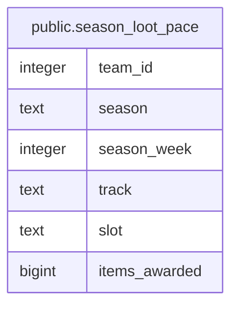

# public.season_loot_pace

## Description

<details>
<summary><strong>Table Definition</strong></summary>

```sql
CREATE VIEW season_loot_pace AS (
 WITH season_bounds AS (
         SELECT rclc_loot.team_id,
            rclc_loot.season,
            min(rclc_loot.awarded_at) AS season_start
           FROM rclc_loot
          GROUP BY rclc_loot.team_id, rclc_loot.season
        )
 SELECT rl.team_id,
    rl.season,
    ((floor((EXTRACT(epoch FROM (rl.awarded_at - sb.season_start)) / ((7 * 86400))::numeric)))::integer + 1) AS season_week,
    rl.track,
    i.slot,
    count(*) AS items_awarded
   FROM ((rclc_loot rl
     JOIN season_bounds sb ON (((sb.team_id = rl.team_id) AND (sb.season = rl.season))))
     LEFT JOIN items i ON ((i.id = rl.item_id)))
  GROUP BY rl.team_id, rl.season, ((floor((EXTRACT(epoch FROM (rl.awarded_at - sb.season_start)) / ((7 * 86400))::numeric)))::integer + 1), rl.track, i.slot
  ORDER BY rl.team_id, rl.season, ((floor((EXTRACT(epoch FROM (rl.awarded_at - sb.season_start)) / ((7 * 86400))::numeric)))::integer + 1)
)
```

</details>

## Columns

| Name | Type | Default | Nullable | Children | Parents | Comment |
| ---- | ---- | ------- | -------- | -------- | ------- | ------- |
| team_id | integer |  | true |  |  |  |
| season | text |  | true |  |  |  |
| season_week | integer |  | true |  |  |  |
| track | text |  | true |  |  |  |
| slot | text |  | true |  |  |  |
| items_awarded | bigint |  | true |  |  |  |

## Referenced Tables

| Name | Columns | Comment | Type |
| ---- | ------- | ------- | ---- |
| [public.rclc_loot](public.rclc_loot.md) | 10 |  | BASE TABLE |
| [rl.awarded_at](rl.awarded_at.md) | 0 |  |  |
| [public.items](public.items.md) | 9 |  | BASE TABLE |

## Relations



---

> Generated by [tbls](https://github.com/k1LoW/tbls)
