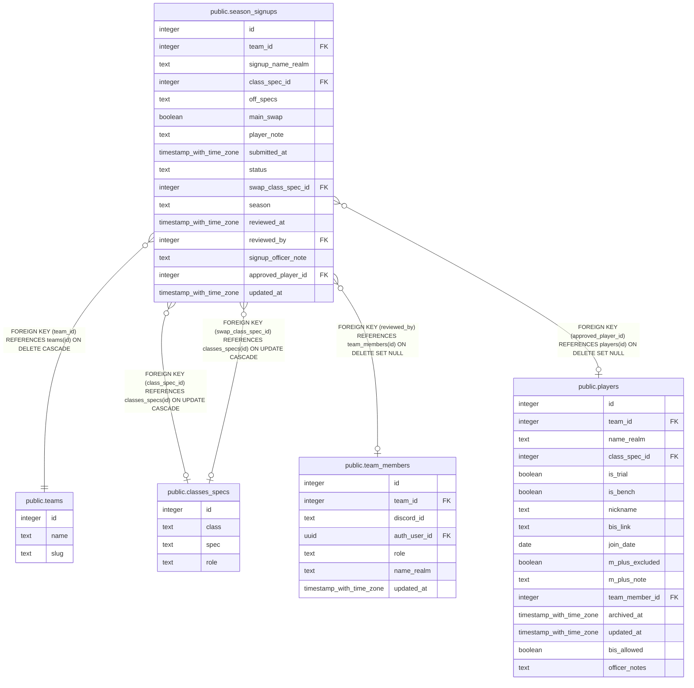

# public.season_signups

## Columns

| Name | Type | Default | Nullable | Children | Parents | Comment |
| ---- | ---- | ------- | -------- | -------- | ------- | ------- |
| id | integer | nextval('signups_id_seq'::regclass) | false |  |  |  |
| team_id | integer |  | false |  | [public.teams](public.teams.md) |  |
| signup_name_realm | text |  | false |  |  |  |
| class_spec_id | integer |  | true |  | [public.classes_specs](public.classes_specs.md) |  |
| off_specs | text |  | true |  |  |  |
| main_swap | boolean | false | false |  |  |  |
| player_note | text |  | true |  |  |  |
| submitted_at | timestamp with time zone | now() | false |  |  |  |
| status | text | 'pending'::text | false |  |  |  |
| swap_class_spec_id | integer |  | true |  | [public.classes_specs](public.classes_specs.md) |  |
| season | text |  | true |  |  |  |
| reviewed_at | timestamp with time zone |  | true |  |  |  |
| reviewed_by | integer |  | true |  | [public.team_members](public.team_members.md) |  |
| signup_officer_note | text |  | true |  |  |  |
| approved_player_id | integer |  | true |  | [public.players](public.players.md) |  |
| updated_at | timestamp with time zone |  | true |  |  |  |

## Constraints

| Name | Type | Definition |
| ---- | ---- | ---------- |
| season_signups_player_only_when_added | CHECK | CHECK (((approved_player_id IS NULL) OR (status = 'added'::text))) |
| season_signups_status_check | CHECK | CHECK ((status = ANY (ARRAY['pending'::text, 'approved'::text, 'rejected'::text, 'added'::text]))) |
| season_signups_swap_class_spec_id_fkey | FOREIGN KEY | FOREIGN KEY (swap_class_spec_id) REFERENCES classes_specs(id) ON UPDATE CASCADE |
| signups_class_spec_id_fkey | FOREIGN KEY | FOREIGN KEY (class_spec_id) REFERENCES classes_specs(id) ON UPDATE CASCADE |
| season_signups_approved_player_id_fkey | FOREIGN KEY | FOREIGN KEY (approved_player_id) REFERENCES players(id) ON DELETE SET NULL |
| signups_pkey | PRIMARY KEY | PRIMARY KEY (id) |
| season_signups_reviewed_by_fkey | FOREIGN KEY | FOREIGN KEY (reviewed_by) REFERENCES team_members(id) ON DELETE SET NULL |
| signups_team_id_fkey | FOREIGN KEY | FOREIGN KEY (team_id) REFERENCES teams(id) ON DELETE CASCADE |

## Indexes

| Name | Definition |
| ---- | ---------- |
| signups_pkey | CREATE UNIQUE INDEX signups_pkey ON public.season_signups USING btree (id) |

## Triggers

| Name | Definition |
| ---- | ---------- |
| trg_season_signups_updated_at | CREATE TRIGGER trg_season_signups_updated_at BEFORE UPDATE ON public.season_signups FOR EACH ROW EXECUTE FUNCTION set_updated_at() |

## Relations

---

> Generated by [tbls](https://github.com/k1LoW/tbls)
