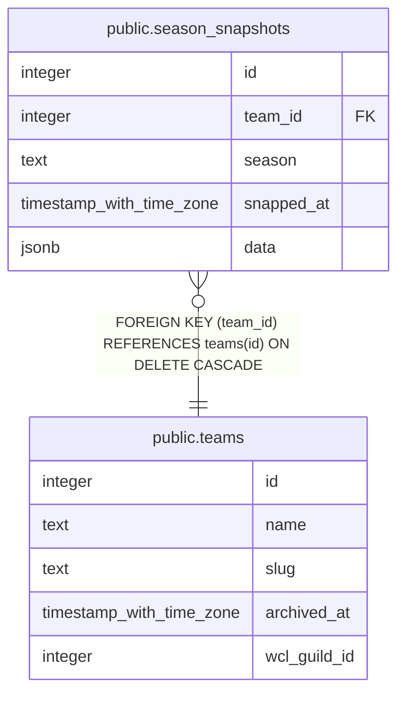

# public.season_snapshots

## Columns

| Name | Type | Default | Nullable | Children | Parents | Comment |
| ---- | ---- | ------- | -------- | -------- | ------- | ------- |
| id | integer | nextval('season_snapshots_id_seq'::regclass) | false |  |  |  |
| team_id | integer |  | false |  | [public.teams](public.teams.md) |  |
| season | text |  | false |  |  |  |
| snapped_at | timestamp with time zone | now() | false |  |  |  |
| data | jsonb |  | false |  |  |  |

## Constraints

| Name | Type | Definition |
| ---- | ---- | ---------- |
| season_snapshots_pkey | PRIMARY KEY | PRIMARY KEY (id) |
| season_snapshots_team_id_season_key | UNIQUE | UNIQUE (team_id, season) |
| season_snapshots_team_id_fkey | FOREIGN KEY | FOREIGN KEY (team_id) REFERENCES teams(id) ON DELETE CASCADE |

## Indexes

| Name | Definition |
| ---- | ---------- |
| season_snapshots_pkey | CREATE UNIQUE INDEX season_snapshots_pkey ON public.season_snapshots USING btree (id) |
| season_snapshots_team_id_season_key | CREATE UNIQUE INDEX season_snapshots_team_id_season_key ON public.season_snapshots USING btree (team_id, season) |

## Relations

---

> Generated by [tbls](https://github.com/k1LoW/tbls)
