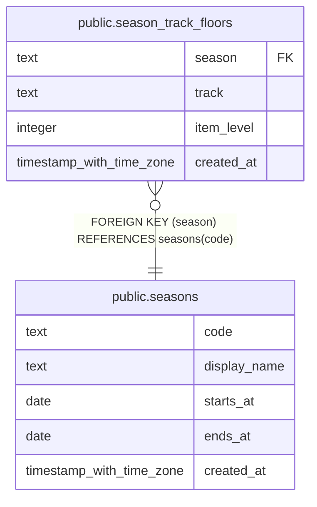

# public.season_track_floors

## Description

The lowest item level of each gear upgrade track in a tier (#1267). blizzard-gear-sync grades equipped gear that carries no track bonus id against the current tier's floors, highest track first. Added by the migration that adds the tier.

## Columns

| Name | Type | Default | Nullable | Children | Parents | Comment |
| ---- | ---- | ------- | -------- | -------- | ------- | ------- |
| season | text |  | false |  | [public.seasons](public.seasons.md) |  |
| track | text |  | false |  |  |  |
| item_level | integer |  | false |  |  |  |
| created_at | timestamp with time zone | now() | false |  |  |  |

## Constraints

| Name | Type | Definition |
| ---- | ---- | ---------- |
| season_track_floors_item_level_check | CHECK | CHECK ((item_level > 0)) |
| season_track_floors_track_check | CHECK | CHECK ((track = ANY (ARRAY['Myth'::text, 'Hero'::text, 'Champion'::text, 'Veteran'::text, 'Adventurer'::text, 'Explorer'::text]))) |
| season_track_floors_season_fkey | FOREIGN KEY | FOREIGN KEY (season) REFERENCES seasons(code) |
| season_track_floors_pkey | PRIMARY KEY | PRIMARY KEY (season, track) |

## Indexes

| Name | Definition |
| ---- | ---------- |
| season_track_floors_pkey | CREATE UNIQUE INDEX season_track_floors_pkey ON public.season_track_floors USING btree (season, track) |

## Relations

---

> Generated by [tbls](https://github.com/k1LoW/tbls)
