# public.seasons

## Description

One row per raid tier (#932). code is the short form every season column references (MID2); display_name is what officers see and type (Midnight Season 2), and nothing keys to it since #936. A tier is added by a migration that closes the outgoing row and inserts the new one.

## Columns

| Name | Type | Default | Nullable | Children | Parents | Comment |
| ---- | ---- | ------- | -------- | -------- | ------- | ------- |
| code | text |  | false | [public.rclc_loot](public.rclc_loot.md) [public.player_wcl_season_perf](public.player_wcl_season_perf.md) [public.priority_order](public.priority_order.md) [public.scoring](public.scoring.md) [public.season_signups](public.season_signups.md) [public.raid_zones](public.raid_zones.md) [public.item_preferences](public.item_preferences.md) [public.tier_token_map](public.tier_token_map.md) [public.boe_items](public.boe_items.md) [public.priority_conflict_dismissals](public.priority_conflict_dismissals.md) [public.priority_order_confirmed_empty](public.priority_order_confirmed_empty.md) [public.priority_stale_dismissals](public.priority_stale_dismissals.md) [public.track_bonus_ids](public.track_bonus_ids.md) [public.team_seasons](public.team_seasons.md) |  |  |
| display_name | text |  | false |  |  |  |
| starts_at | date |  | false |  |  | The day the tier launched. |
| ends_at | date |  | true |  |  | Null while the tier is open-ended; the next tier's migration sets it. Tiers do not overlap (seasons_no_overlap), so at most one row is null. |
| created_at | timestamp with time zone | now() | false |  |  |  |

## Constraints

| Name | Type | Definition |
| ---- | ---- | ---------- |
| seasons_window_check | CHECK | CHECK (((ends_at IS NULL) OR (ends_at >= starts_at))) |
| seasons_pkey | PRIMARY KEY | PRIMARY KEY (code) |
| seasons_display_name_key | UNIQUE | UNIQUE (display_name) |
| seasons_no_overlap | x | EXCLUDE USING gist (daterange(starts_at, ends_at, '[]'::text) WITH &&) |

## Indexes

| Name | Definition |
| ---- | ---------- |
| seasons_pkey | CREATE UNIQUE INDEX seasons_pkey ON public.seasons USING btree (code) |
| seasons_display_name_key | CREATE UNIQUE INDEX seasons_display_name_key ON public.seasons USING btree (display_name) |
| seasons_no_overlap | CREATE INDEX seasons_no_overlap ON public.seasons USING gist (daterange(starts_at, ends_at, '[]'::text)) |

## Relations

```mermaid
erDiagram

"public.rclc_loot" }o--o| "public.seasons" : "FOREIGN KEY (season) REFERENCES seasons(code)"
"public.player_wcl_season_perf" }o--|| "public.seasons" : "FOREIGN KEY (season) REFERENCES seasons(code)"
"public.priority_order" }o--|| "public.seasons" : "FOREIGN KEY (season) REFERENCES seasons(code)"
"public.scoring" }o--|| "public.seasons" : "FOREIGN KEY (season) REFERENCES seasons(code)"
"public.season_signups" }o--o| "public.seasons" : "FOREIGN KEY (season) REFERENCES seasons(code)"
"public.raid_zones" }o--|| "public.seasons" : "FOREIGN KEY (season) REFERENCES seasons(code)"
"public.item_preferences" }o--o| "public.seasons" : "FOREIGN KEY (season) REFERENCES seasons(code)"
"public.tier_token_map" }o--|| "public.seasons" : "FOREIGN KEY (season) REFERENCES seasons(code)"
"public.boe_items" }o--o| "public.seasons" : "FOREIGN KEY (season) REFERENCES seasons(code)"
"public.priority_conflict_dismissals" }o--|| "public.seasons" : "FOREIGN KEY (season) REFERENCES seasons(code)"
"public.priority_order_confirmed_empty" }o--|| "public.seasons" : "FOREIGN KEY (season) REFERENCES seasons(code)"
"public.priority_stale_dismissals" }o--|| "public.seasons" : "FOREIGN KEY (season) REFERENCES seasons(code)"
"public.track_bonus_ids" }o--|| "public.seasons" : "FOREIGN KEY (season) REFERENCES seasons(code)"
"public.team_seasons" }o--|| "public.seasons" : "FOREIGN KEY (season_code) REFERENCES seasons(code)"

"public.seasons" {
  text code
  text display_name
  date starts_at
  date ends_at
  timestamp_with_time_zone created_at
}
"public.rclc_loot" {
  integer id
  integer team_id FK
  integer player_id FK
  integer item_id FK
  text track
  text season FK
  timestamp_with_time_zone awarded_at
  text rclc_id
  text dedupe_key
  text boss
  text response
}
"public.player_wcl_season_perf" {
  integer id
  integer player_id FK
  integer team_id FK
  text season FK
  numeric best_perf_avg
  numeric median_perf_avg
  timestamp_with_time_zone fetched_at
}
"public.priority_order" {
  integer id
  integer team_id FK
  text season FK
  integer item_id FK
  text track
  integer rank
  integer player_id FK
  timestamp_with_time_zone updated_at
}
"public.scoring" {
  integer id
  integer player_id FK
  numeric recent_score
  numeric trend_score
  numeric best_score
  numeric performance_score
  numeric attendance_score
  numeric attendance_pct
  text season FK
  timestamp_with_time_zone updated_at
  integer team_id FK
}
"public.season_signups" {
  integer id
  integer team_id FK
  text signup_name_realm
  integer class_spec_id FK
  text off_specs
  boolean main_swap
  text player_note
  timestamp_with_time_zone submitted_at
  text status
  integer swap_class_spec_id FK
  text season FK
  timestamp_with_time_zone reviewed_at
  integer reviewed_by FK
  text signup_officer_note
  integer approved_player_id FK
  timestamp_with_time_zone updated_at
  text swap_from_name_realm
  uuid auth_user_id FK
}
"public.raid_zones" {
  integer id
  integer wcl_zone_id
  text name
  text season FK
  boolean is_mini_raid
  integer sort_index
}
"public.item_preferences" {
  integer id
  integer team_id FK
  integer player_id FK
  integer item_id FK
  text status
  text note
  text slot
  timestamp_with_time_zone updated_at
  timestamp_with_time_zone created_at
  text season FK
  boolean synced_bis
}
"public.tier_token_map" {
  integer id
  integer token_item_id FK
  text class
  integer resolved_item_id FK
  timestamp_with_time_zone created_at
  text season FK
}
"public.boe_items" {
  integer id
  integer team_id FK
  integer player_id FK
  text finder_name
  integer item_id FK
  text item_name
  text track
  text season FK
  text note
  text status
  timestamp_with_time_zone found_at
  timestamp_with_time_zone sold_at
  timestamp_with_time_zone payout_paid_at
  timestamp_with_time_zone retired_at
  bigint sale_price
  bigint finder_payout
  bigint guild_cut
  bigint payout_floor
  bigint payout_pivot
  timestamp_with_time_zone updated_at
  timestamp_with_time_zone created_at
  boolean payout_donated
  text upgrade_rank
  bigint ah_fee
  text finder_discord_id
  timestamp_with_time_zone found_posted_at
}
"public.priority_conflict_dismissals" {
  integer id
  integer team_id FK
  integer player_id FK
  text season FK
  text boss
  text track
  uuid dismissed_by FK
  timestamp_with_time_zone dismissed_at
}
"public.priority_order_confirmed_empty" {
  integer team_id FK
  text season FK
  integer item_id FK
  text track
  timestamp_with_time_zone marked_at
}
"public.priority_stale_dismissals" {
  integer id
  integer team_id FK
  integer player_id FK
  text season FK
  integer item_id FK
  uuid dismissed_by FK
  timestamp_with_time_zone dismissed_at
}
"public.track_bonus_ids" {
  integer bonus_id
  text track
  smallint rank
  text season FK
  timestamp_with_time_zone created_at
}
"public.team_seasons" {
  bigint id
  integer team_id FK
  text season_code FK
  boolean signups_open
  boolean wishlist_open
  timestamp_with_time_zone updated_at
}
```

---

> Generated by [tbls](https://github.com/k1LoW/tbls)
