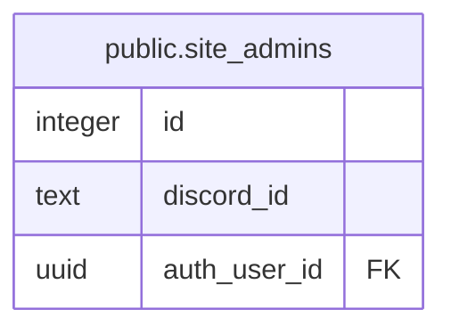

# public.site_admins

## Columns

| Name | Type | Default | Nullable | Children | Parents | Comment |
| ---- | ---- | ------- | -------- | -------- | ------- | ------- |
| id | integer | nextval('site_admins_id_seq'::regclass) | false |  |  |  |
| discord_id | text |  | false |  |  |  |
| auth_user_id | uuid |  | true |  |  |  |

## Constraints

| Name | Type | Definition |
| ---- | ---- | ---------- |
| site_admins_auth_user_id_fkey | FOREIGN KEY | FOREIGN KEY (auth_user_id) REFERENCES auth.users(id) ON DELETE SET NULL |
| site_admins_discord_id_key | UNIQUE | UNIQUE (discord_id) |
| site_admins_pkey | PRIMARY KEY | PRIMARY KEY (id) |

## Indexes

| Name | Definition |
| ---- | ---------- |
| site_admins_discord_id_key | CREATE UNIQUE INDEX site_admins_discord_id_key ON public.site_admins USING btree (discord_id) |
| site_admins_pkey | CREATE UNIQUE INDEX site_admins_pkey ON public.site_admins USING btree (id) |

## Relations

---

> Generated by [tbls](https://github.com/k1LoW/tbls)
