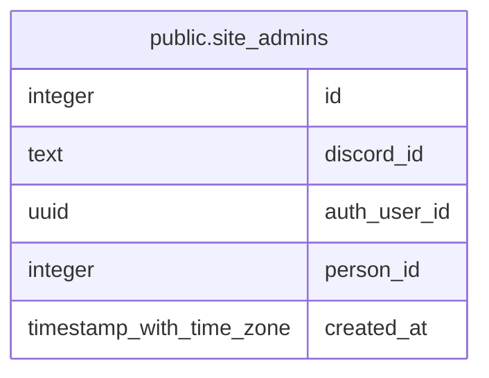

# public.site_admins

## Description

Read-only view of guild_grants (#942), dropped at cutover (#1105).

<details>
<summary><strong>Table Definition</strong></summary>

```sql
CREATE VIEW site_admins AS (
 SELECT g.id,
    p.discord_id,
    p.auth_user_id,
    g.person_id,
    g.created_at
   FROM (guild_grants g
     JOIN people p ON ((p.id = g.person_id)))
  WHERE (g.grant_type = 'site_admin'::text)
)
```

</details>

## Columns

| Name | Type | Default | Nullable | Children | Parents | Comment |
| ---- | ---- | ------- | -------- | -------- | ------- | ------- |
| id | integer |  | true |  |  |  |
| discord_id | text |  | true |  |  |  |
| auth_user_id | uuid |  | true |  |  |  |
| person_id | integer |  | true |  |  |  |
| created_at | timestamp with time zone |  | true |  |  |  |

## Referenced Tables

| Name | Columns | Comment | Type |
| ---- | ------- | ------- | ---- |
| [public.guild_grants](public.guild_grants.md) | 5 | Guild-wide grants, one row per person per grant per guild (#942). Replaced site_admins, guild_officers and boe_managers, which remain as read-only views until cutover. | BASE TABLE |
| [public.people](public.people.md) | 4 | One row per human (#942). auth_user_id is their sign-in account, null for a Discord id listed on a grant before its owner signed in. discord_id is null for an account with no Discord linked. Grant tables point here through person_id. | BASE TABLE |

## Relations


```mermaid
erDiagram


"public.site_admins" {
  integer id
  text discord_id
  uuid auth_user_id
  integer person_id
  timestamp_with_time_zone created_at
}
```

---

> Generated by [tbls](https://github.com/k1LoW/tbls)
