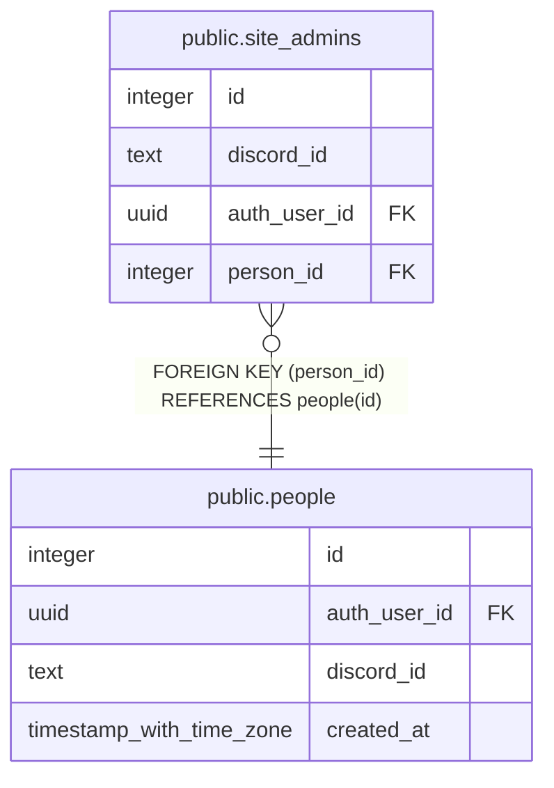

# public.site_admins

## Columns

| Name | Type | Default | Nullable | Children | Parents | Comment |
| ---- | ---- | ------- | -------- | -------- | ------- | ------- |
| id | integer | nextval('site_admins_id_seq'::regclass) | false |  |  |  |
| discord_id | text |  | false |  |  |  |
| auth_user_id | uuid |  | true |  |  |  |
| person_id | integer |  | false |  | [public.people](public.people.md) |  |

## Constraints

| Name | Type | Definition |
| ---- | ---- | ---------- |
| site_admins_auth_user_id_fkey | FOREIGN KEY | FOREIGN KEY (auth_user_id) REFERENCES auth.users(id) ON DELETE SET NULL |
| site_admins_discord_id_key | UNIQUE | UNIQUE (discord_id) |
| site_admins_pkey | PRIMARY KEY | PRIMARY KEY (id) |
| site_admins_person_id_fkey | FOREIGN KEY | FOREIGN KEY (person_id) REFERENCES people(id) |

## Indexes

| Name | Definition |
| ---- | ---------- |
| site_admins_discord_id_key | CREATE UNIQUE INDEX site_admins_discord_id_key ON public.site_admins USING btree (discord_id) |
| site_admins_pkey | CREATE UNIQUE INDEX site_admins_pkey ON public.site_admins USING btree (id) |
| site_admins_person_id_idx | CREATE INDEX site_admins_person_id_idx ON public.site_admins USING btree (person_id) |

## Triggers

| Name | Definition |
| ---- | ---------- |
| site_admins_set_person | CREATE TRIGGER site_admins_set_person BEFORE INSERT OR UPDATE ON public.site_admins FOR EACH ROW EXECUTE FUNCTION set_person_from_discord_id() |

## Relations

```mermaid
erDiagram

"public.site_admins" }o--|| "public.people" : "FOREIGN KEY (person_id) REFERENCES people(id)"

"public.site_admins" {
  integer id
  text discord_id
  uuid auth_user_id FK
  integer person_id FK
}
"public.people" {
  integer id
  uuid auth_user_id FK
  text discord_id
  timestamp_with_time_zone created_at
}
```

---

> Generated by [tbls](https://github.com/k1LoW/tbls)
