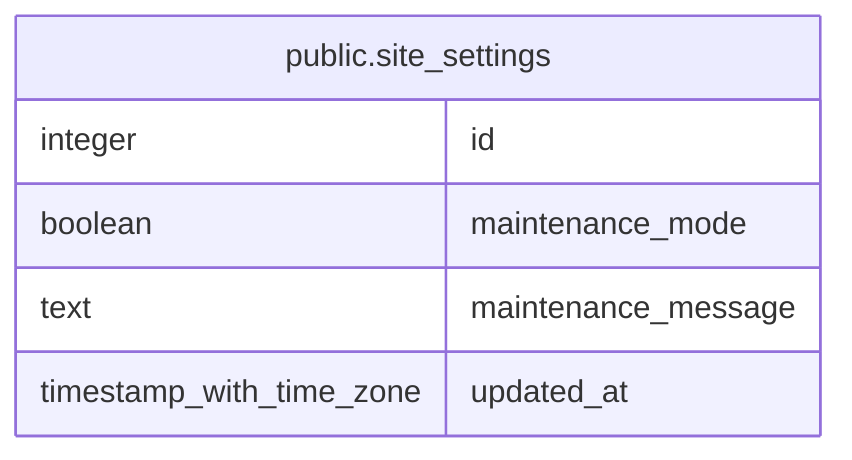

# public.site_settings

## Columns

| Name | Type | Default | Nullable | Children | Parents | Comment |
| ---- | ---- | ------- | -------- | -------- | ------- | ------- |
| id | integer | 1 | false |  |  |  |
| maintenance_mode | boolean | false | false |  |  |  |
| maintenance_message | text |  | true |  |  |  |
| updated_at | timestamp with time zone | now() | false |  |  |  |

## Constraints

| Name | Type | Definition |
| ---- | ---- | ---------- |
| site_settings_pkey | PRIMARY KEY | PRIMARY KEY (id) |

## Indexes

| Name | Definition |
| ---- | ---------- |
| site_settings_pkey | CREATE UNIQUE INDEX site_settings_pkey ON public.site_settings USING btree (id) |

## Relations

---

> Generated by [tbls](https://github.com/k1LoW/tbls)
