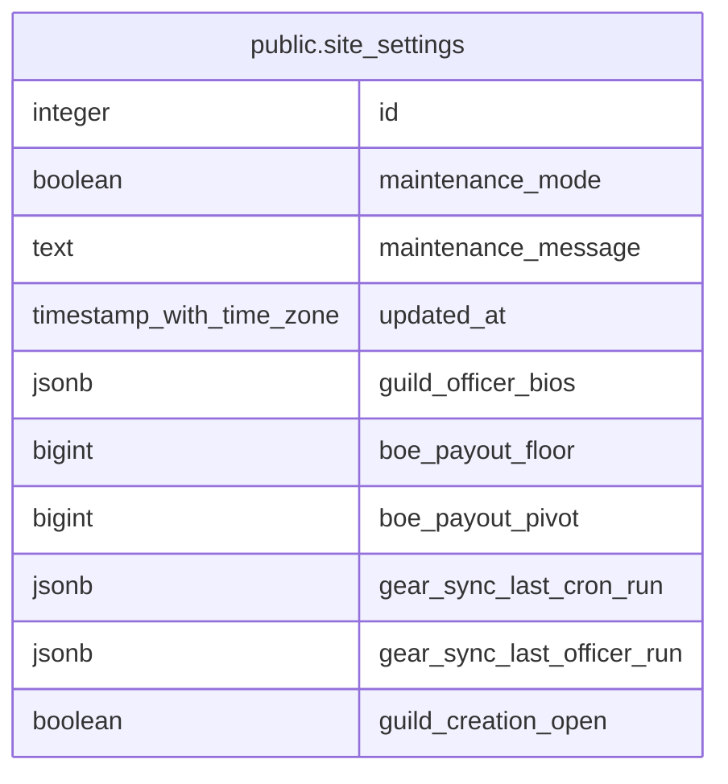

# public.site_settings

## Columns

| Name | Type | Default | Nullable | Children | Parents | Comment |
| ---- | ---- | ------- | -------- | -------- | ------- | ------- |
| id | integer | 1 | false |  |  |  |
| maintenance_mode | boolean | false | false |  |  |  |
| maintenance_message | text |  | true |  |  |  |
| updated_at | timestamp with time zone | now() | false |  |  |  |
| guild_officer_bios | jsonb | '[]'::jsonb | false |  |  |  |
| boe_payout_floor | bigint | 20000 | false |  |  |  |
| boe_payout_pivot | bigint | 100000 | false |  |  |  |
| gear_sync_last_cron_run | jsonb |  | true |  |  | Outcome of the last scheduled blizzard-gear-sync sweep, written by the function: trigger, started_at, finished_at, synced, skipped, teams, players, error (first message or null). |
| gear_sync_last_officer_run | jsonb |  | true |  |  | Outcome of the last officer-triggered whole-team blizzard-gear-sync run (Sync Gear Levels Now), same shape as gear_sync_last_cron_run. A single-raider sync is not recorded. |
| guild_creation_open | boolean | false | false |  |  | When true, any signed-in person with Discord connected can create a guild and its first team (create_guild()). When false, only a site admin can. Flipped by admin_set_guild_creation_open() (#1226). |

## Constraints

| Name | Type | Definition |
| ---- | ---- | ---------- |
| site_settings_boe_payout_floor_nonneg | CHECK | CHECK ((boe_payout_floor >= 0)) |
| site_settings_boe_payout_pivot_positive | CHECK | CHECK ((boe_payout_pivot > 0)) |
| site_settings_pkey | PRIMARY KEY | PRIMARY KEY (id) |

## Indexes

| Name | Definition |
| ---- | ---------- |
| site_settings_pkey | CREATE UNIQUE INDEX site_settings_pkey ON public.site_settings USING btree (id) |

## Relations

```mermaid
erDiagram


"public.site_settings" {
  integer id
  boolean maintenance_mode
  text maintenance_message
  timestamp_with_time_zone updated_at
  jsonb guild_officer_bios
  bigint boe_payout_floor
  bigint boe_payout_pivot
  jsonb gear_sync_last_cron_run
  jsonb gear_sync_last_officer_run
  boolean guild_creation_open
}
```

---

> Generated by [tbls](https://github.com/k1LoW/tbls)
