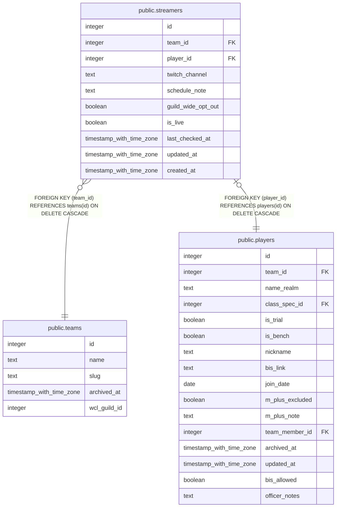

# public.streamers

## Columns

| Name | Type | Default | Nullable | Children | Parents | Comment |
| ---- | ---- | ------- | -------- | -------- | ------- | ------- |
| id | integer | nextval('streamers_id_seq'::regclass) | false |  |  |  |
| team_id | integer |  | false |  | [public.teams](public.teams.md) |  |
| player_id | integer |  | false |  | [public.players](public.players.md) |  |
| twitch_channel | text |  | false |  |  |  |
| schedule_note | text |  | true |  |  |  |
| guild_wide_opt_out | boolean | false | false |  |  |  |
| is_live | boolean | false | false |  |  |  |
| last_checked_at | timestamp with time zone |  | true |  |  |  |
| updated_at | timestamp with time zone |  | true |  |  |  |
| created_at | timestamp with time zone | now() | false |  |  |  |

## Constraints

| Name | Type | Definition |
| ---- | ---- | ---------- |
| streamers_player_id_fkey | FOREIGN KEY | FOREIGN KEY (player_id) REFERENCES players(id) ON DELETE CASCADE |
| streamers_team_id_fkey | FOREIGN KEY | FOREIGN KEY (team_id) REFERENCES teams(id) ON DELETE CASCADE |
| streamers_pkey | PRIMARY KEY | PRIMARY KEY (id) |
| streamers_player_id_key | UNIQUE | UNIQUE (player_id) |

## Indexes

| Name | Definition |
| ---- | ---------- |
| streamers_pkey | CREATE UNIQUE INDEX streamers_pkey ON public.streamers USING btree (id) |
| streamers_player_id_key | CREATE UNIQUE INDEX streamers_player_id_key ON public.streamers USING btree (player_id) |

## Triggers

| Name | Definition |
| ---- | ---------- |
| trg_streamers_team_id_check | CREATE TRIGGER trg_streamers_team_id_check BEFORE INSERT OR UPDATE ON public.streamers FOR EACH ROW EXECUTE FUNCTION check_team_id_matches_player() |
| trg_streamers_updated_at | CREATE TRIGGER trg_streamers_updated_at BEFORE UPDATE ON public.streamers FOR EACH ROW EXECUTE FUNCTION set_updated_at() |

## Relations

---

> Generated by [tbls](https://github.com/k1LoW/tbls)
