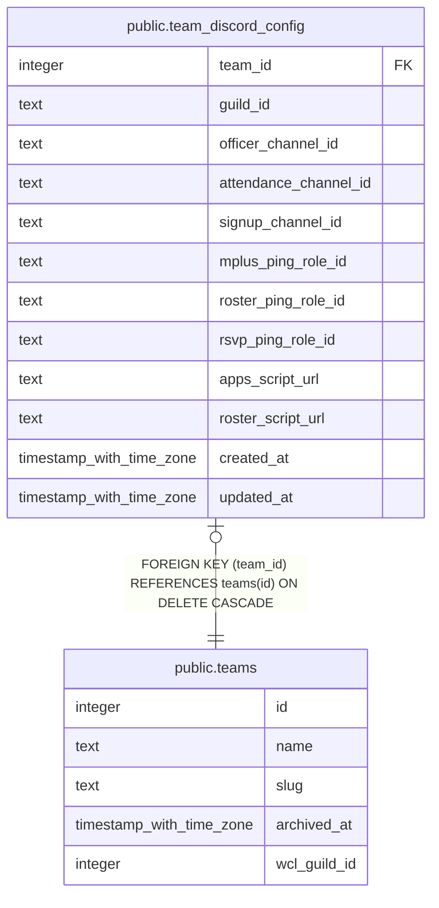

# public.team_discord_config

## Description

Per-team Discord infra config for the consolidated multi-tenant bot (#991): guild/channel/role ids and script URLs the bot needs to route a relayed action to the right place. Written and read only by the bot's service-role client; no read use case for an officer or end user. Mirrors raid_signup_sheets' locked-down shape (#900).

## Columns

| Name | Type | Default | Nullable | Children | Parents | Comment |
| ---- | ---- | ------- | -------- | -------- | ------- | ------- |
| team_id | integer |  | false |  | [public.teams](public.teams.md) |  |
| guild_id | text |  | false |  |  |  |
| officer_channel_id | text |  | false |  |  |  |
| attendance_channel_id | text |  | true |  |  |  |
| signup_channel_id | text |  | true |  |  |  |
| mplus_ping_role_id | text |  | true |  |  |  |
| roster_ping_role_id | text |  | true |  |  |  |
| rsvp_ping_role_id | text |  | true |  |  |  |
| apps_script_url | text |  | true |  |  |  |
| roster_script_url | text |  | true |  |  |  |
| created_at | timestamp with time zone | now() | false |  |  |  |
| updated_at | timestamp with time zone | now() | false |  |  |  |

## Constraints

| Name | Type | Definition |
| ---- | ---- | ---------- |
| team_discord_config_team_id_fkey | FOREIGN KEY | FOREIGN KEY (team_id) REFERENCES teams(id) ON DELETE CASCADE |
| team_discord_config_pkey | PRIMARY KEY | PRIMARY KEY (team_id) |

## Indexes

| Name | Definition |
| ---- | ---------- |
| team_discord_config_pkey | CREATE UNIQUE INDEX team_discord_config_pkey ON public.team_discord_config USING btree (team_id) |

## Relations

---

> Generated by [tbls](https://github.com/k1LoW/tbls)
