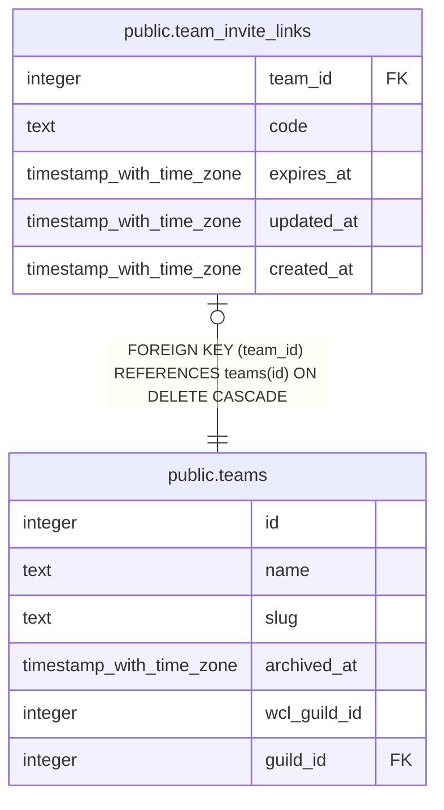

# public.team_invite_links

## Description

One active invite code per team (#1264). Resetting overwrites the row, so the old code stops resolving immediately.

## Columns

| Name | Type | Default | Nullable | Children | Parents | Comment |
| ---- | ---- | ------- | -------- | -------- | ------- | ------- |
| team_id | integer |  | false |  | [public.teams](public.teams.md) |  |
| code | text |  | false |  |  |  |
| expires_at | timestamp with time zone |  | true |  |  |  |
| updated_at | timestamp with time zone |  | true |  |  |  |
| created_at | timestamp with time zone | now() | false |  |  |  |

## Constraints

| Name | Type | Definition |
| ---- | ---- | ---------- |
| team_invite_links_code_format | CHECK | CHECK ((code ~ '^[a-z0-9]+(-[a-z0-9]+)*$'::text)) |
| team_invite_links_team_id_fkey | FOREIGN KEY | FOREIGN KEY (team_id) REFERENCES teams(id) ON DELETE CASCADE |
| team_invite_links_pkey | PRIMARY KEY | PRIMARY KEY (team_id) |
| team_invite_links_code_key | UNIQUE | UNIQUE (code) |

## Indexes

| Name | Definition |
| ---- | ---------- |
| team_invite_links_pkey | CREATE UNIQUE INDEX team_invite_links_pkey ON public.team_invite_links USING btree (team_id) |
| team_invite_links_code_key | CREATE UNIQUE INDEX team_invite_links_code_key ON public.team_invite_links USING btree (code) |

## Triggers

| Name | Definition |
| ---- | ---------- |
| trg_team_invite_links_updated_at | CREATE TRIGGER trg_team_invite_links_updated_at BEFORE UPDATE ON public.team_invite_links FOR EACH ROW EXECUTE FUNCTION set_updated_at() |

## Relations

---

> Generated by [tbls](https://github.com/k1LoW/tbls)
