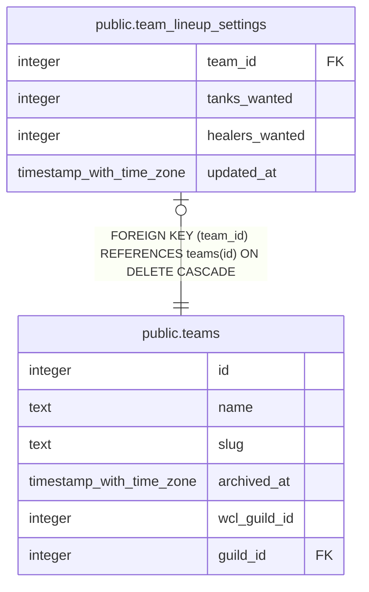

# public.team_lineup_settings

## Description

A team's own tanks-wanted and healers-wanted counts for the boss lineup's "Needs a look" check (#1244), defaulting to 2 and 4 when a team has no row. Written only by set_lineup_role_targets().

## Columns

| Name | Type | Default | Nullable | Children | Parents | Comment |
| ---- | ---- | ------- | -------- | -------- | ------- | ------- |
| team_id | integer |  | false |  | [public.teams](public.teams.md) |  |
| tanks_wanted | integer | 2 | false |  |  |  |
| healers_wanted | integer | 4 | false |  |  |  |
| updated_at | timestamp with time zone | now() | false |  |  |  |

## Constraints

| Name | Type | Definition |
| ---- | ---- | ---------- |
| team_lineup_settings_healers_wanted_check | CHECK | CHECK (((healers_wanted >= 0) AND (healers_wanted <= 20))) |
| team_lineup_settings_tanks_wanted_check | CHECK | CHECK (((tanks_wanted >= 0) AND (tanks_wanted <= 20))) |
| team_lineup_settings_team_id_fkey | FOREIGN KEY | FOREIGN KEY (team_id) REFERENCES teams(id) ON DELETE CASCADE |
| team_lineup_settings_pkey | PRIMARY KEY | PRIMARY KEY (team_id) |

## Indexes

| Name | Definition |
| ---- | ---------- |
| team_lineup_settings_pkey | CREATE UNIQUE INDEX team_lineup_settings_pkey ON public.team_lineup_settings USING btree (team_id) |

## Relations

---

> Generated by [tbls](https://github.com/k1LoW/tbls)
