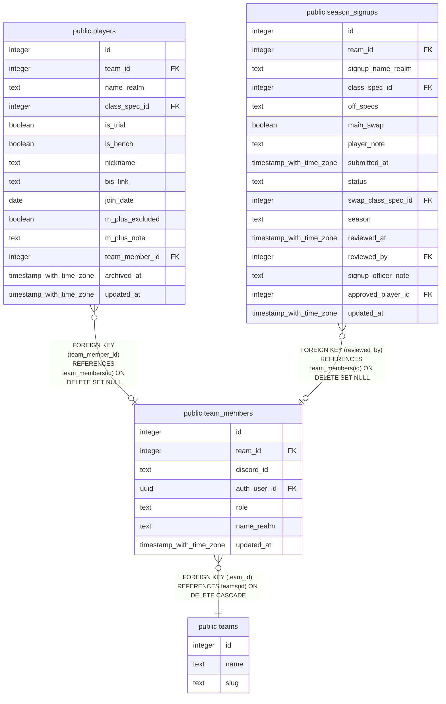

# public.team_members

## Columns

| Name | Type | Default | Nullable | Children | Parents | Comment |
| ---- | ---- | ------- | -------- | -------- | ------- | ------- |
| id | integer | nextval('team_members_id_seq'::regclass) | false | [public.players](public.players.md) [public.season_signups](public.season_signups.md) |  |  |
| team_id | integer |  | false |  | [public.teams](public.teams.md) |  |
| discord_id | text |  | false |  |  |  |
| auth_user_id | uuid |  | true |  |  |  |
| role | text |  | false |  |  |  |
| name_realm | text |  | true |  |  |  |
| updated_at | timestamp with time zone |  | true |  |  |  |

## Constraints

| Name | Type | Definition |
| ---- | ---- | ---------- |
| team_members_role_check | CHECK | CHECK ((role = ANY (ARRAY['raider'::text, 'officer'::text, 'team_leader'::text]))) |
| team_members_auth_user_id_fkey | FOREIGN KEY | FOREIGN KEY (auth_user_id) REFERENCES auth.users(id) ON DELETE SET NULL |
| team_members_pkey | PRIMARY KEY | PRIMARY KEY (id) |
| team_members_team_id_discord_id_key | UNIQUE | UNIQUE (team_id, discord_id) |
| team_members_team_id_fkey | FOREIGN KEY | FOREIGN KEY (team_id) REFERENCES teams(id) ON DELETE CASCADE |

## Indexes

| Name | Definition |
| ---- | ---------- |
| team_members_pkey | CREATE UNIQUE INDEX team_members_pkey ON public.team_members USING btree (id) |
| team_members_team_id_discord_id_key | CREATE UNIQUE INDEX team_members_team_id_discord_id_key ON public.team_members USING btree (team_id, discord_id) |

## Triggers

| Name | Definition |
| ---- | ---------- |
| trg_team_members_updated_at | CREATE TRIGGER trg_team_members_updated_at BEFORE UPDATE ON public.team_members FOR EACH ROW EXECUTE FUNCTION set_updated_at() |

## Relations

---

> Generated by [tbls](https://github.com/k1LoW/tbls)
