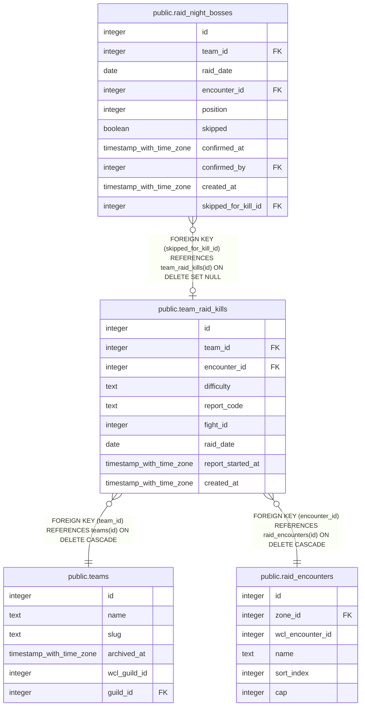

# public.team_raid_kills

## Description

Every Heroic and Mythic boss kill in a team's Warcraft Logs reports (#1246), one row per fight, dated by the report's raid night. Written only by wcl-progression-sync. team_raid_progress holds the first kill per boss; this holds them all. Each insert takes the bosses it killed off the team's later nights that lockout (skip_killed_bosses()).

## Columns

| Name | Type | Default | Nullable | Children | Parents | Comment |
| ---- | ---- | ------- | -------- | -------- | ------- | ------- |
| id | integer |  | false | [public.raid_night_bosses](public.raid_night_bosses.md) |  |  |
| team_id | integer |  | false |  | [public.teams](public.teams.md) |  |
| encounter_id | integer |  | false |  | [public.raid_encounters](public.raid_encounters.md) |  |
| difficulty | text |  | false |  |  |  |
| report_code | text |  | false |  |  |  |
| fight_id | integer |  | false |  |  |  |
| raid_date | date |  | false |  |  |  |
| report_started_at | timestamp with time zone |  | false |  |  |  |
| created_at | timestamp with time zone | now() | false |  |  |  |

## Constraints

| Name | Type | Definition |
| ---- | ---- | ---------- |
| team_raid_kills_difficulty_check | CHECK | CHECK ((difficulty = ANY (ARRAY['heroic'::text, 'mythic'::text]))) |
| team_raid_kills_team_id_fkey | FOREIGN KEY | FOREIGN KEY (team_id) REFERENCES teams(id) ON DELETE CASCADE |
| team_raid_kills_encounter_id_fkey | FOREIGN KEY | FOREIGN KEY (encounter_id) REFERENCES raid_encounters(id) ON DELETE CASCADE |
| team_raid_kills_pkey | PRIMARY KEY | PRIMARY KEY (id) |
| team_raid_kills_team_id_report_code_fight_id_key | UNIQUE | UNIQUE (team_id, report_code, fight_id) |

## Indexes

| Name | Definition |
| ---- | ---------- |
| team_raid_kills_pkey | CREATE UNIQUE INDEX team_raid_kills_pkey ON public.team_raid_kills USING btree (id) |
| team_raid_kills_team_id_report_code_fight_id_key | CREATE UNIQUE INDEX team_raid_kills_team_id_report_code_fight_id_key ON public.team_raid_kills USING btree (team_id, report_code, fight_id) |
| team_raid_kills_team_encounter_date_idx | CREATE INDEX team_raid_kills_team_encounter_date_idx ON public.team_raid_kills USING btree (team_id, encounter_id, raid_date) |

## Triggers

| Name | Definition |
| ---- | ---------- |
| team_raid_kills_skip_killed_bosses | CREATE TRIGGER team_raid_kills_skip_killed_bosses AFTER INSERT ON public.team_raid_kills REFERENCING NEW TABLE AS new_kills FOR EACH STATEMENT EXECUTE FUNCTION team_raid_kills_skip_killed_bosses() |

## Relations

---

> Generated by [tbls](https://github.com/k1LoW/tbls)
