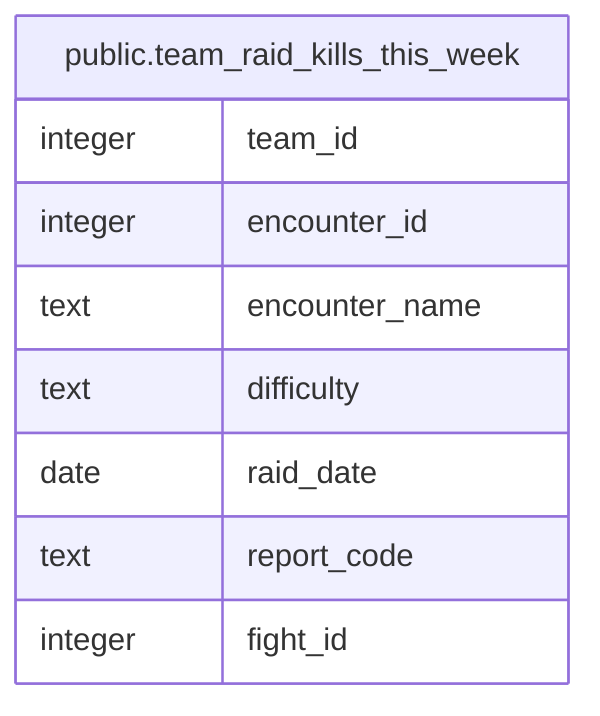

# public.team_raid_kills_this_week

## Description

Each boss a team has killed since this week's Tuesday reset, once per difficulty, with its first kill of the week (#1246).

<details>
<summary><strong>Table Definition</strong></summary>

```sql
CREATE VIEW team_raid_kills_this_week AS (
 SELECT DISTINCT ON (k.team_id, k.encounter_id, k.difficulty) k.team_id,
    k.encounter_id,
    e.name AS encounter_name,
    k.difficulty,
    k.raid_date,
    k.report_code,
    k.fight_id
   FROM (team_raid_kills k
     JOIN raid_encounters e ON ((e.id = k.encounter_id)))
  WHERE ((k.raid_date >= lockout_start_at(now())) AND (k.raid_date < (lockout_start_at(now()) + 7)))
  ORDER BY k.team_id, k.encounter_id, k.difficulty, k.report_started_at, k.fight_id
)
```

</details>

## Columns

| Name | Type | Default | Nullable | Children | Parents | Comment |
| ---- | ---- | ------- | -------- | -------- | ------- | ------- |
| team_id | integer |  | true |  |  |  |
| encounter_id | integer |  | true |  |  |  |
| encounter_name | text |  | true |  |  |  |
| difficulty | text |  | true |  |  |  |
| raid_date | date |  | true |  |  |  |
| report_code | text |  | true |  |  |  |
| fight_id | integer |  | true |  |  |  |

## Referenced Tables

| Name | Columns | Comment | Type |
| ---- | ------- | ------- | ---- |
| [public.team_raid_kills](public.team_raid_kills.md) | 9 | Every Heroic and Mythic boss kill in a team's Warcraft Logs reports (#1246), alt runs included as on team_raid_progress, one row per fight, dated by the report's raid night. Written only by wcl-progression-sync. team_raid_progress holds the first kill per boss; this holds them all. Each insert takes the bosses it killed off the team's later nights that lockout (skip_killed_bosses()). | BASE TABLE |
| [public.raid_encounters](public.raid_encounters.md) | 6 |  | BASE TABLE |

## Relations



---

> Generated by [tbls](https://github.com/k1LoW/tbls)
