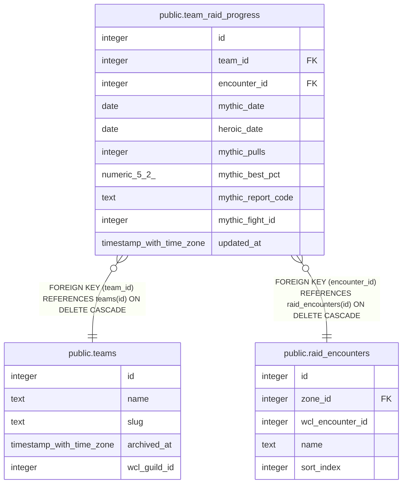

# public.team_raid_progress

## Columns

| Name | Type | Default | Nullable | Children | Parents | Comment |
| ---- | ---- | ------- | -------- | -------- | ------- | ------- |
| id | integer | nextval('team_raid_progress_id_seq'::regclass) | false |  |  |  |
| team_id | integer |  | false |  | [public.teams](public.teams.md) |  |
| encounter_id | integer |  | false |  | [public.raid_encounters](public.raid_encounters.md) |  |
| mythic_date | date |  | true |  |  |  |
| heroic_date | date |  | true |  |  |  |
| mythic_pulls | integer |  | true |  |  |  |
| mythic_best_pct | numeric(5,2) |  | true |  |  |  |
| mythic_report_code | text |  | true |  |  |  |
| mythic_fight_id | integer |  | true |  |  |  |
| updated_at | timestamp with time zone |  | true |  |  |  |

## Constraints

| Name | Type | Definition |
| ---- | ---- | ---------- |
| team_raid_progress_team_id_fkey | FOREIGN KEY | FOREIGN KEY (team_id) REFERENCES teams(id) ON DELETE CASCADE |
| team_raid_progress_encounter_id_fkey | FOREIGN KEY | FOREIGN KEY (encounter_id) REFERENCES raid_encounters(id) ON DELETE CASCADE |
| team_raid_progress_pkey | PRIMARY KEY | PRIMARY KEY (id) |
| team_raid_progress_team_id_encounter_id_key | UNIQUE | UNIQUE (team_id, encounter_id) |

## Indexes

| Name | Definition |
| ---- | ---------- |
| team_raid_progress_pkey | CREATE UNIQUE INDEX team_raid_progress_pkey ON public.team_raid_progress USING btree (id) |
| team_raid_progress_team_id_encounter_id_key | CREATE UNIQUE INDEX team_raid_progress_team_id_encounter_id_key ON public.team_raid_progress USING btree (team_id, encounter_id) |

## Triggers

| Name | Definition |
| ---- | ---------- |
| trg_team_raid_progress_updated_at | CREATE TRIGGER trg_team_raid_progress_updated_at BEFORE UPDATE ON public.team_raid_progress FOR EACH ROW EXECUTE FUNCTION set_updated_at() |

## Relations

---

> Generated by [tbls](https://github.com/k1LoW/tbls)
