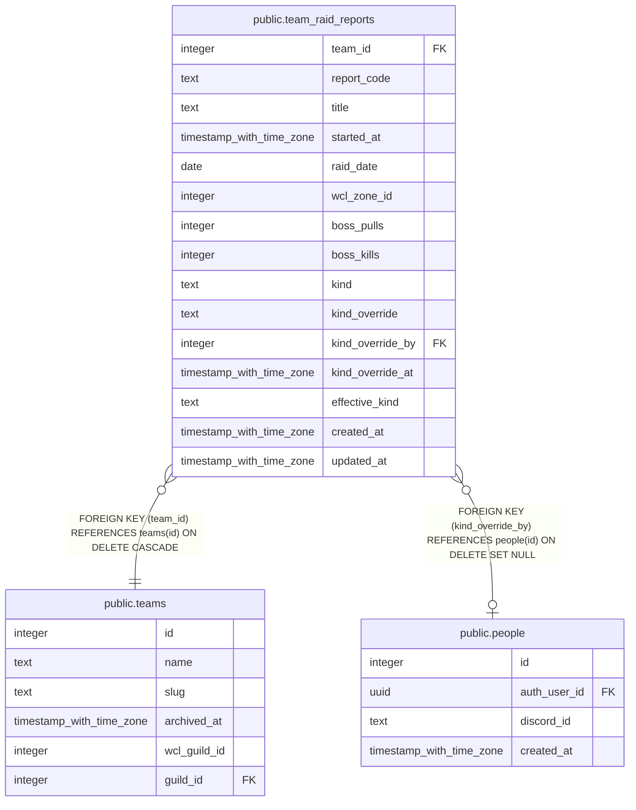

# public.team_raid_reports

## Description

Every Warcraft Logs report the progression sync reads for a team (#1469), one row per team and report, rewritten on every run and never deleted. kind is the title rule's verdict, kind_override an officer's choice, effective_kind the one that counts. Written only by wcl-progression-sync.

## Columns

| Name | Type | Default | Nullable | Extra Definition | Children | Parents | Comment |
| ---- | ---- | ------- | -------- | ---------------- | -------- | ------- | ------- |
| team_id | integer |  | false |  |  | [public.teams](public.teams.md) |  |
| report_code | text |  | false |  |  |  |  |
| title | text |  | true |  |  |  | The title as Warcraft Logs returns it; null when it has none. A report uploaded with no title gets a default one there, such as the raid's name. |
| started_at | timestamp with time zone |  | false |  |  |  |  |
| raid_date | date |  | false |  |  |  | The report's raid night: its start in Eastern time, a start before 6 a.m. counting as the night before, as on team_raid_kills and attendance. |
| wcl_zone_id | integer |  | true |  |  |  | The zone Warcraft Logs tags the report with, null when it has none. Not a key to raid_zones: a report can be of a raid no team lists. |
| boss_pulls | integer | 0 | false |  |  |  | Heroic and Mythic fights in the report on the bosses of the raids the team lists for the current tier, as the progression card counts them. |
| boss_kills | integer | 0 | false |  |  |  | The kills among boss_pulls. |
| kind | text |  | false |  |  |  | The title rule's verdict: alt when the title has "Alt" as its own word, main otherwise. Rewritten on every run, so a report renamed on Warcraft Logs moves on the next one. |
| kind_override | text |  | true |  |  |  | An officer's choice of main or alt (#1472), which the sync never writes; null leaves the verdict standing. |
| kind_override_by | integer |  | true |  |  | [public.people](public.people.md) | The person who set kind_override. |
| kind_override_at | timestamp with time zone |  | true |  |  |  | When kind_override was set; set exactly when it is. |
| effective_kind | text |  | true | GENERATED ALWAYS AS COALESCE(kind_override, kind) STORED |  |  | kind_override when set, else kind: whether the report counts as the team's raid. |
| created_at | timestamp with time zone | now() | false |  |  |  |  |
| updated_at | timestamp with time zone | now() | false |  |  |  |  |

## Constraints

| Name | Type | Definition |
| ---- | ---- | ---------- |
| team_raid_reports_kind_check | CHECK | CHECK ((kind = ANY (ARRAY['main'::text, 'alt'::text]))) |
| team_raid_reports_kind_override_check | CHECK | CHECK ((kind_override = ANY (ARRAY['main'::text, 'alt'::text]))) |
| team_raid_reports_override_has_time | CHECK | CHECK (((kind_override IS NULL) = (kind_override_at IS NULL))) |
| team_raid_reports_team_id_fkey | FOREIGN KEY | FOREIGN KEY (team_id) REFERENCES teams(id) ON DELETE CASCADE |
| team_raid_reports_kind_override_by_fkey | FOREIGN KEY | FOREIGN KEY (kind_override_by) REFERENCES people(id) ON DELETE SET NULL |
| team_raid_reports_pkey | PRIMARY KEY | PRIMARY KEY (team_id, report_code) |

## Indexes

| Name | Definition |
| ---- | ---------- |
| team_raid_reports_pkey | CREATE UNIQUE INDEX team_raid_reports_pkey ON public.team_raid_reports USING btree (team_id, report_code) |
| team_raid_reports_team_date_idx | CREATE INDEX team_raid_reports_team_date_idx ON public.team_raid_reports USING btree (team_id, raid_date DESC) |

## Triggers

| Name | Definition |
| ---- | ---------- |
| trg_team_raid_reports_updated_at | CREATE TRIGGER trg_team_raid_reports_updated_at BEFORE UPDATE ON public.team_raid_reports FOR EACH ROW EXECUTE FUNCTION set_updated_at() |

## Relations

---

> Generated by [tbls](https://github.com/k1LoW/tbls)
