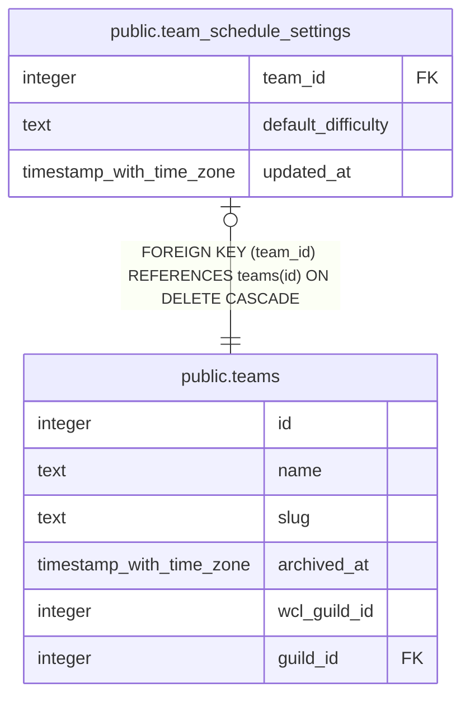

# public.team_schedule_settings

## Description

A team's own schedule settings (#1246): the raid difficulty every weekly or added night follows unless it sets its own. No row, or a null, means not set. Written by the officers who write raid_schedule.

## Columns

| Name | Type | Default | Nullable | Children | Parents | Comment |
| ---- | ---- | ------- | -------- | -------- | ------- | ------- |
| team_id | integer |  | false |  | [public.teams](public.teams.md) |  |
| default_difficulty | text |  | true |  |  |  |
| updated_at | timestamp with time zone | now() | false |  |  |  |

## Constraints

| Name | Type | Definition |
| ---- | ---- | ---------- |
| team_schedule_settings_default_difficulty_check | CHECK | CHECK ((default_difficulty = ANY (ARRAY['heroic'::text, 'mythic'::text]))) |
| team_schedule_settings_team_id_fkey | FOREIGN KEY | FOREIGN KEY (team_id) REFERENCES teams(id) ON DELETE CASCADE |
| team_schedule_settings_pkey | PRIMARY KEY | PRIMARY KEY (team_id) |

## Indexes

| Name | Definition |
| ---- | ---------- |
| team_schedule_settings_pkey | CREATE UNIQUE INDEX team_schedule_settings_pkey ON public.team_schedule_settings USING btree (team_id) |

## Triggers

| Name | Definition |
| ---- | ---------- |
| trg_team_schedule_settings_updated_at | CREATE TRIGGER trg_team_schedule_settings_updated_at BEFORE UPDATE ON public.team_schedule_settings FOR EACH ROW EXECUTE FUNCTION set_updated_at() |

## Relations

---

> Generated by [tbls](https://github.com/k1LoW/tbls)
