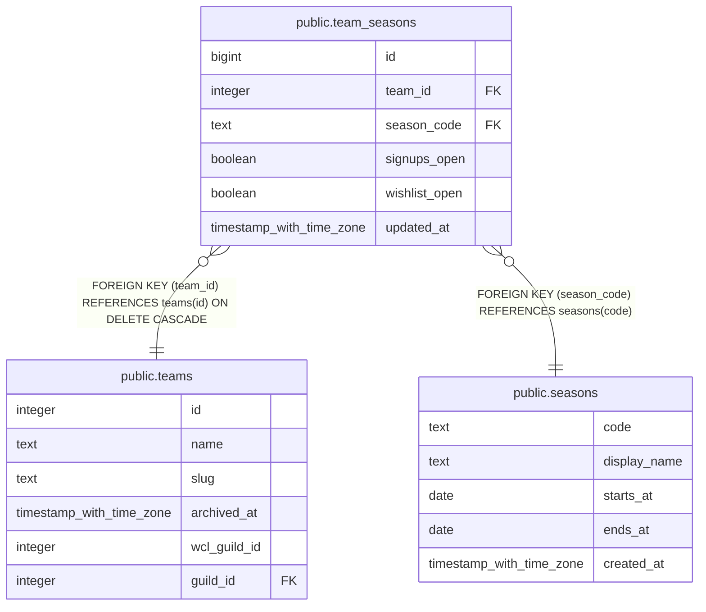

# public.team_seasons

## Description

A team's two switches per tier (#939): whether raiders can sign up and whether they can edit their wishlist. No row means both closed. Written only by set_team_season().

## Columns

| Name | Type | Default | Nullable | Children | Parents | Comment |
| ---- | ---- | ------- | -------- | -------- | ------- | ------- |
| id | bigint |  | false |  |  |  |
| team_id | integer |  | false |  | [public.teams](public.teams.md) |  |
| season_code | text |  | false |  | [public.seasons](public.seasons.md) | The tier the switches are for; a seasons.code. |
| signups_open | boolean | false | false |  |  | Raiders can submit a season signup for this tier (submit_season_signup checks it). |
| wishlist_open | boolean | false | false |  |  | Raiders can tag and edit their wishlist for this tier (the site and the app check it; the insert path follows in #936). |
| updated_at | timestamp with time zone | now() | false |  |  |  |

## Constraints

| Name | Type | Definition |
| ---- | ---- | ---------- |
| team_seasons_team_id_fkey | FOREIGN KEY | FOREIGN KEY (team_id) REFERENCES teams(id) ON DELETE CASCADE |
| team_seasons_season_code_fkey | FOREIGN KEY | FOREIGN KEY (season_code) REFERENCES seasons(code) |
| team_seasons_pkey | PRIMARY KEY | PRIMARY KEY (id) |
| team_seasons_team_id_season_code_key | UNIQUE | UNIQUE (team_id, season_code) |

## Indexes

| Name | Definition |
| ---- | ---------- |
| team_seasons_pkey | CREATE UNIQUE INDEX team_seasons_pkey ON public.team_seasons USING btree (id) |
| team_seasons_team_id_season_code_key | CREATE UNIQUE INDEX team_seasons_team_id_season_code_key ON public.team_seasons USING btree (team_id, season_code) |

## Relations

---

> Generated by [tbls](https://github.com/k1LoW/tbls)
