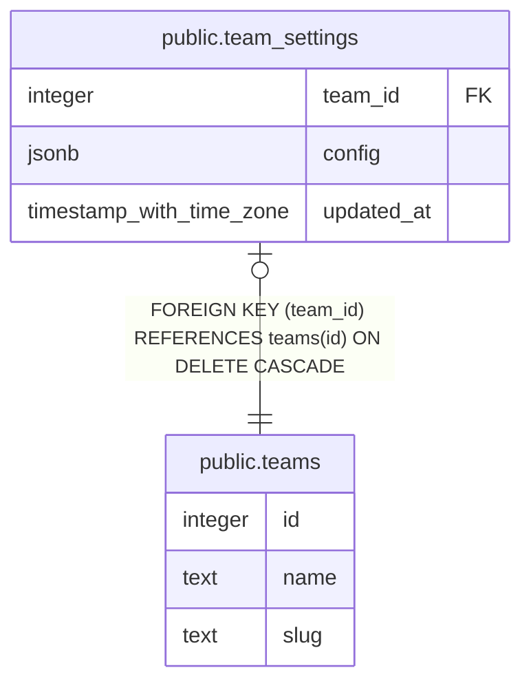

# public.team_settings

## Columns

| Name | Type | Default | Nullable | Children | Parents | Comment |
| ---- | ---- | ------- | -------- | -------- | ------- | ------- |
| team_id | integer |  | false |  | [public.teams](public.teams.md) |  |
| config | jsonb | '{}'::jsonb | false |  |  |  |
| updated_at | timestamp with time zone |  | true |  |  |  |

## Constraints

| Name | Type | Definition |
| ---- | ---- | ---------- |
| settings_pkey | PRIMARY KEY | PRIMARY KEY (team_id) |
| settings_team_id_fkey | FOREIGN KEY | FOREIGN KEY (team_id) REFERENCES teams(id) ON DELETE CASCADE |

## Indexes

| Name | Definition |
| ---- | ---------- |
| settings_pkey | CREATE UNIQUE INDEX settings_pkey ON public.team_settings USING btree (team_id) |

## Triggers

| Name | Definition |
| ---- | ---------- |
| trg_team_settings_updated_at | CREATE TRIGGER trg_team_settings_updated_at BEFORE UPDATE ON public.team_settings FOR EACH ROW EXECUTE FUNCTION set_updated_at() |

## Relations

---

> Generated by [tbls](https://github.com/k1LoW/tbls)
