# public.teams

## Columns

| Name | Type | Default | Nullable | Children | Parents | Comment |
| ---- | ---- | ------- | -------- | -------- | ------- | ------- |
| id | integer | nextval('teams_id_seq'::regclass) | false | [public.attendance](public.attendance.md) [public.audit_log](public.audit_log.md) [public.bis_requests](public.bis_requests.md) [public.rclc_loot](public.rclc_loot.md) [public.mplus_exclusion_requests](public.mplus_exclusion_requests.md) [public.player_wcl_season_perf](public.player_wcl_season_perf.md) [public.players](public.players.md) [public.priority_order](public.priority_order.md) [public.season_signups](public.season_signups.md) [public.season_snapshots](public.season_snapshots.md) [public.self_received_requests](public.self_received_requests.md) [public.team_members](public.team_members.md) [public.team_settings](public.team_settings.md) |  |  |
| name | text |  | false |  |  |  |
| slug | text |  | false |  |  |  |
| archived_at | timestamp with time zone |  | true |  |  |  |
| wcl_guild_id | integer |  | true |  |  |  |

## Constraints

| Name | Type | Definition |
| ---- | ---- | ---------- |
| teams_name_key | UNIQUE | UNIQUE (name) |
| teams_pkey | PRIMARY KEY | PRIMARY KEY (id) |
| teams_slug_key | UNIQUE | UNIQUE (slug) |

## Indexes

| Name | Definition |
| ---- | ---------- |
| teams_name_key | CREATE UNIQUE INDEX teams_name_key ON public.teams USING btree (name) |
| teams_pkey | CREATE UNIQUE INDEX teams_pkey ON public.teams USING btree (id) |
| teams_slug_key | CREATE UNIQUE INDEX teams_slug_key ON public.teams USING btree (slug) |

## Relations

```mermaid
erDiagram

"public.attendance" }o--|| "public.teams" : "FOREIGN KEY (team_id) REFERENCES teams(id) ON DELETE CASCADE"
"public.audit_log" }o--o| "public.teams" : "FOREIGN KEY (team_id) REFERENCES teams(id) ON DELETE CASCADE"
"public.bis_requests" }o--|| "public.teams" : "FOREIGN KEY (team_id) REFERENCES teams(id) ON DELETE CASCADE"
"public.rclc_loot" }o--|| "public.teams" : "FOREIGN KEY (team_id) REFERENCES teams(id) ON DELETE CASCADE"
"public.mplus_exclusion_requests" }o--|| "public.teams" : "FOREIGN KEY (team_id) REFERENCES teams(id) ON DELETE CASCADE"
"public.player_wcl_season_perf" }o--|| "public.teams" : "FOREIGN KEY (team_id) REFERENCES teams(id) ON DELETE CASCADE"
"public.players" }o--|| "public.teams" : "FOREIGN KEY (team_id) REFERENCES teams(id) ON DELETE CASCADE"
"public.priority_order" }o--|| "public.teams" : "FOREIGN KEY (team_id) REFERENCES teams(id) ON DELETE CASCADE"
"public.season_signups" }o--|| "public.teams" : "FOREIGN KEY (team_id) REFERENCES teams(id) ON DELETE CASCADE"
"public.season_snapshots" }o--|| "public.teams" : "FOREIGN KEY (team_id) REFERENCES teams(id) ON DELETE CASCADE"
"public.self_received_requests" }o--|| "public.teams" : "FOREIGN KEY (team_id) REFERENCES teams(id) ON DELETE CASCADE"
"public.team_members" }o--|| "public.teams" : "FOREIGN KEY (team_id) REFERENCES teams(id) ON DELETE CASCADE"
"public.team_settings" |o--|| "public.teams" : "FOREIGN KEY (team_id) REFERENCES teams(id) ON DELETE CASCADE"

"public.teams" {
  integer id
  text name
  text slug
  timestamp_with_time_zone archived_at
  integer wcl_guild_id
}
"public.attendance" {
  integer id
  integer team_id FK
  integer player_id FK
  date raid_date
  text status
  boolean report_excluded
  text report_id
  text source
  text report_title
}
"public.audit_log" {
  integer id
  integer team_id FK
  uuid actor_id FK
  text action
  text target_type
  integer target_id
  jsonb detail
  timestamp_with_time_zone created_at
}
"public.bis_requests" {
  integer id
  integer team_id FK
  integer player_id FK
  timestamp_with_time_zone submitted_at
  text status
  text bis_link
  text player_note
}
"public.rclc_loot" {
  integer id
  integer team_id FK
  integer player_id FK
  integer item_id FK
  text track
  text season
  timestamp_with_time_zone awarded_at
  text rclc_id
  text dedupe_key
  text boss
}
"public.mplus_exclusion_requests" {
  integer id
  integer team_id FK
  integer player_id FK
  text reason
  timestamp_with_time_zone submitted_at
  text status
  text raiderio_url
  text officer_notes
  timestamp_with_time_zone updated_at
}
"public.player_wcl_season_perf" {
  integer id
  integer player_id FK
  integer team_id FK
  text season
  numeric best_perf_avg
  numeric median_perf_avg
  timestamp_with_time_zone fetched_at
}
"public.players" {
  integer id
  integer team_id FK
  text name_realm
  integer class_spec_id FK
  boolean is_trial
  boolean is_bench
  text nickname
  text bis_link
  date join_date
  boolean m_plus_excluded
  text m_plus_note
  integer team_member_id FK
  timestamp_with_time_zone archived_at
  timestamp_with_time_zone updated_at
  boolean bis_allowed
  text officer_notes
}
"public.priority_order" {
  integer id
  integer team_id FK
  text season
  integer item_id FK
  text track
  integer rank
  integer player_id FK
  timestamp_with_time_zone updated_at
}
"public.season_signups" {
  integer id
  integer team_id FK
  text signup_name_realm
  integer class_spec_id FK
  text off_specs
  boolean main_swap
  text player_note
  timestamp_with_time_zone submitted_at
  text status
  integer swap_class_spec_id FK
  text season
  timestamp_with_time_zone reviewed_at
  integer reviewed_by FK
  text signup_officer_note
  integer approved_player_id FK
  timestamp_with_time_zone updated_at
}
"public.season_snapshots" {
  integer id
  integer team_id FK
  text season
  timestamp_with_time_zone snapped_at
  jsonb data
}
"public.self_received_requests" {
  integer id
  integer team_id FK
  integer player_id FK
  integer self_item_id FK
  timestamp_with_time_zone submitted_at
  text status
  text track
  text source
  text note
}
"public.team_members" {
  integer id
  integer team_id FK
  text discord_id
  uuid auth_user_id FK
  text role
  text name_realm
  timestamp_with_time_zone updated_at
}
"public.team_settings" {
  integer team_id FK
  jsonb config
  timestamp_with_time_zone updated_at
}
```

---

> Generated by [tbls](https://github.com/k1LoW/tbls)
