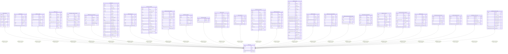

# public.teams

## Columns

| Name | Type | Default | Nullable | Children | Parents | Comment |
| ---- | ---- | ------- | -------- | -------- | ------- | ------- |
| id | integer | nextval('teams_id_seq'::regclass) | false | [public.attendance](public.attendance.md) [public.audit_log](public.audit_log.md) [public.bis_requests](public.bis_requests.md) [public.rclc_loot](public.rclc_loot.md) [public.mplus_exclusion_requests](public.mplus_exclusion_requests.md) [public.player_wcl_season_perf](public.player_wcl_season_perf.md) [public.players](public.players.md) [public.priority_order](public.priority_order.md) [public.season_signups](public.season_signups.md) [public.self_received_requests](public.self_received_requests.md) [public.team_members](public.team_members.md) [public.team_settings](public.team_settings.md) [public.streamers](public.streamers.md) [public.notifications](public.notifications.md) [public.team_raid_progress](public.team_raid_progress.md) [public.item_preferences](public.item_preferences.md) [public.boe_items](public.boe_items.md) [public.boe_listings](public.boe_listings.md) [public.priority_conflict_dismissals](public.priority_conflict_dismissals.md) [public.priority_order_confirmed_empty](public.priority_order_confirmed_empty.md) [public.priority_stale_dismissals](public.priority_stale_dismissals.md) [public.raid_schedule](public.raid_schedule.md) [public.raid_schedule_exceptions](public.raid_schedule_exceptions.md) [public.raid_rsvps](public.raid_rsvps.md) [public.raid_rsvp_reminders_sent](public.raid_rsvp_reminders_sent.md) [public.raid_signup_sheets](public.raid_signup_sheets.md) [public.player_officer_notes](public.player_officer_notes.md) [public.team_discord_config](public.team_discord_config.md) |  |  |
| name | text |  | false |  |  |  |
| slug | text |  | false |  |  |  |
| archived_at | timestamp with time zone |  | true |  |  |  |
| wcl_guild_id | integer |  | true |  |  |  |

## Constraints

| Name | Type | Definition |
| ---- | ---- | ---------- |
| teams_name_key | UNIQUE | UNIQUE (name) |
| teams_pkey | PRIMARY KEY | PRIMARY KEY (id) |
| teams_slug_key | UNIQUE | UNIQUE (slug) |

## Indexes

| Name | Definition |
| ---- | ---------- |
| teams_name_key | CREATE UNIQUE INDEX teams_name_key ON public.teams USING btree (name) |
| teams_pkey | CREATE UNIQUE INDEX teams_pkey ON public.teams USING btree (id) |
| teams_slug_key | CREATE UNIQUE INDEX teams_slug_key ON public.teams USING btree (slug) |

## Relations

```mermaid
erDiagram

"public.attendance" }o--|| "public.teams" : "FOREIGN KEY (team_id) REFERENCES teams(id) ON DELETE CASCADE"
"public.audit_log" }o--o| "public.teams" : "FOREIGN KEY (team_id) REFERENCES teams(id) ON DELETE CASCADE"
"public.bis_requests" }o--|| "public.teams" : "FOREIGN KEY (team_id) REFERENCES teams(id) ON DELETE CASCADE"
"public.rclc_loot" }o--|| "public.teams" : "FOREIGN KEY (team_id) REFERENCES teams(id) ON DELETE CASCADE"
"public.mplus_exclusion_requests" }o--|| "public.teams" : "FOREIGN KEY (team_id) REFERENCES teams(id) ON DELETE CASCADE"
"public.player_wcl_season_perf" }o--|| "public.teams" : "FOREIGN KEY (team_id) REFERENCES teams(id) ON DELETE CASCADE"
"public.players" }o--|| "public.teams" : "FOREIGN KEY (team_id) REFERENCES teams(id) ON DELETE CASCADE"
"public.priority_order" }o--|| "public.teams" : "FOREIGN KEY (team_id) REFERENCES teams(id) ON DELETE CASCADE"
"public.season_signups" }o--|| "public.teams" : "FOREIGN KEY (team_id) REFERENCES teams(id) ON DELETE CASCADE"
"public.self_received_requests" }o--|| "public.teams" : "FOREIGN KEY (team_id) REFERENCES teams(id) ON DELETE CASCADE"
"public.team_members" }o--|| "public.teams" : "FOREIGN KEY (team_id) REFERENCES teams(id) ON DELETE CASCADE"
"public.team_settings" |o--|| "public.teams" : "FOREIGN KEY (team_id) REFERENCES teams(id) ON DELETE CASCADE"
"public.streamers" }o--|| "public.teams" : "FOREIGN KEY (team_id) REFERENCES teams(id) ON DELETE CASCADE"
"public.notifications" }o--|| "public.teams" : "FOREIGN KEY (team_id) REFERENCES teams(id) ON DELETE CASCADE"
"public.team_raid_progress" }o--|| "public.teams" : "FOREIGN KEY (team_id) REFERENCES teams(id) ON DELETE CASCADE"
"public.item_preferences" }o--|| "public.teams" : "FOREIGN KEY (team_id) REFERENCES teams(id) ON DELETE CASCADE"
"public.boe_items" }o--|| "public.teams" : "FOREIGN KEY (team_id) REFERENCES teams(id) ON DELETE CASCADE"
"public.boe_listings" }o--|| "public.teams" : "FOREIGN KEY (team_id) REFERENCES teams(id) ON DELETE CASCADE"
"public.priority_conflict_dismissals" }o--|| "public.teams" : "FOREIGN KEY (team_id) REFERENCES teams(id) ON DELETE CASCADE"
"public.priority_order_confirmed_empty" }o--|| "public.teams" : "FOREIGN KEY (team_id) REFERENCES teams(id) ON DELETE CASCADE"
"public.priority_stale_dismissals" }o--|| "public.teams" : "FOREIGN KEY (team_id) REFERENCES teams(id) ON DELETE CASCADE"
"public.raid_schedule" }o--|| "public.teams" : "FOREIGN KEY (team_id) REFERENCES teams(id) ON DELETE CASCADE"
"public.raid_schedule_exceptions" }o--|| "public.teams" : "FOREIGN KEY (team_id) REFERENCES teams(id) ON DELETE CASCADE"
"public.raid_rsvps" }o--|| "public.teams" : "FOREIGN KEY (team_id) REFERENCES teams(id) ON DELETE CASCADE"
"public.raid_rsvp_reminders_sent" }o--|| "public.teams" : "FOREIGN KEY (team_id) REFERENCES teams(id) ON DELETE CASCADE"
"public.raid_signup_sheets" }o--|| "public.teams" : "FOREIGN KEY (team_id) REFERENCES teams(id) ON DELETE CASCADE"
"public.player_officer_notes" }o--|| "public.teams" : "FOREIGN KEY (team_id) REFERENCES teams(id) ON DELETE CASCADE"
"public.team_discord_config" |o--|| "public.teams" : "FOREIGN KEY (team_id) REFERENCES teams(id) ON DELETE CASCADE"

"public.teams" {
  integer id
  text name
  text slug
  timestamp_with_time_zone archived_at
  integer wcl_guild_id
}
"public.attendance" {
  integer id
  integer team_id FK
  integer player_id FK
  date raid_date
  text status
  boolean report_excluded
  text report_id
  text source
  text report_title
}
"public.audit_log" {
  integer id
  integer team_id FK
  uuid actor_id FK
  text action
  text target_type
  integer target_id
  jsonb detail
  timestamp_with_time_zone created_at
}
"public.bis_requests" {
  integer id
  integer team_id FK
  integer player_id FK
  timestamp_with_time_zone submitted_at
  text status
  text bis_link
  text player_note
  text officer_notes
}
"public.rclc_loot" {
  integer id
  integer team_id FK
  integer player_id FK
  integer item_id FK
  text track
  text season
  timestamp_with_time_zone awarded_at
  text rclc_id
  text dedupe_key
  text boss
  text response
}
"public.mplus_exclusion_requests" {
  integer id
  integer team_id FK
  integer player_id FK
  text reason
  timestamp_with_time_zone submitted_at
  text status
  text raiderio_url
  text officer_notes
  timestamp_with_time_zone updated_at
}
"public.player_wcl_season_perf" {
  integer id
  integer player_id FK
  integer team_id FK
  text season
  numeric best_perf_avg
  numeric median_perf_avg
  timestamp_with_time_zone fetched_at
}
"public.players" {
  integer id
  integer team_id FK
  text name_realm
  integer class_spec_id FK
  boolean is_trial
  boolean is_bench
  text nickname
  text bis_link
  date join_date
  boolean m_plus_excluded
  text m_plus_note
  integer team_member_id FK
  timestamp_with_time_zone archived_at
  timestamp_with_time_zone updated_at
  boolean bis_allowed
  boolean is_backup_tank
  boolean is_backup_healer
  boolean wishlist_allowed
  integer tier_pieces_equipped
  timestamp_with_time_zone tier_pieces_synced_at
  integer bonus_roll_encounter_id FK
  boolean is_rotator
  timestamp_with_time_zone bis_link_updated_at
}
"public.priority_order" {
  integer id
  integer team_id FK
  text season
  integer item_id FK
  text track
  integer rank
  integer player_id FK
  timestamp_with_time_zone updated_at
}
"public.season_signups" {
  integer id
  integer team_id FK
  text signup_name_realm
  integer class_spec_id FK
  text off_specs
  boolean main_swap
  text player_note
  timestamp_with_time_zone submitted_at
  text status
  integer swap_class_spec_id FK
  text season
  timestamp_with_time_zone reviewed_at
  integer reviewed_by FK
  text signup_officer_note
  integer approved_player_id FK
  timestamp_with_time_zone updated_at
  text swap_from_name_realm
  uuid auth_user_id FK
}
"public.self_received_requests" {
  integer id
  integer team_id FK
  integer player_id FK
  integer self_item_id FK
  timestamp_with_time_zone submitted_at
  text status
  text track
  text source
  text note
  text slot
  timestamp_with_time_zone updated_at
  text officer_notes
}
"public.team_members" {
  integer id
  integer team_id FK
  text discord_id
  uuid auth_user_id FK
  text role
  text name_realm
  timestamp_with_time_zone updated_at
}
"public.team_settings" {
  integer team_id FK
  jsonb config
  timestamp_with_time_zone updated_at
}
"public.streamers" {
  integer id
  integer team_id FK
  integer player_id FK
  text twitch_channel
  text schedule_note
  boolean guild_wide_opt_out
  boolean is_live
  timestamp_with_time_zone last_checked_at
  timestamp_with_time_zone updated_at
  timestamp_with_time_zone created_at
}
"public.notifications" {
  integer id
  integer team_id FK
  integer player_id FK
  text message
  boolean read
  timestamp_with_time_zone created_at
}
"public.team_raid_progress" {
  integer id
  integer team_id FK
  integer encounter_id FK
  date mythic_date
  date heroic_date
  integer mythic_pulls
  numeric_5_2_ mythic_best_pct
  text mythic_report_code
  integer mythic_fight_id
  timestamp_with_time_zone updated_at
  integer heroic_pulls
  numeric_5_2_ heroic_best_pct
  text heroic_report_code
  integer heroic_fight_id
}
"public.item_preferences" {
  integer id
  integer team_id FK
  integer player_id FK
  integer item_id FK
  text status
  text note
  text slot
  timestamp_with_time_zone updated_at
  timestamp_with_time_zone created_at
  text season
  boolean synced_bis
}
"public.boe_items" {
  integer id
  integer team_id FK
  integer player_id FK
  text finder_name
  integer item_id FK
  text item_name
  text track
  text season
  text note
  text status
  timestamp_with_time_zone found_at
  timestamp_with_time_zone sold_at
  timestamp_with_time_zone payout_paid_at
  timestamp_with_time_zone retired_at
  bigint sale_price
  bigint finder_payout
  bigint guild_cut
  bigint payout_floor
  bigint payout_pivot
  timestamp_with_time_zone updated_at
  timestamp_with_time_zone created_at
  boolean payout_donated
  text upgrade_rank
  bigint ah_fee
  text finder_discord_id
  timestamp_with_time_zone found_posted_at
}
"public.boe_listings" {
  integer id
  integer team_id FK
  integer boe_item_id FK
  timestamp_with_time_zone listed_at
  bigint price
  text note
  timestamp_with_time_zone updated_at
  timestamp_with_time_zone created_at
}
"public.priority_conflict_dismissals" {
  integer id
  integer team_id FK
  integer player_id FK
  text season
  text boss
  text track
  uuid dismissed_by FK
  timestamp_with_time_zone dismissed_at
}
"public.priority_order_confirmed_empty" {
  integer team_id FK
  text season
  integer item_id FK
  text track
  timestamp_with_time_zone marked_at
}
"public.priority_stale_dismissals" {
  integer id
  integer team_id FK
  integer player_id FK
  text season
  integer item_id FK
  uuid dismissed_by FK
  timestamp_with_time_zone dismissed_at
}
"public.raid_schedule" {
  integer id
  integer team_id FK
  integer weekday
  time_without_time_zone start_time
  text timezone
  integer duration_minutes
  boolean active
  boolean is_optional
  timestamp_with_time_zone created_at
}
"public.raid_schedule_exceptions" {
  integer id
  integer team_id FK
  date raid_date
  text exception_type
  time_without_time_zone start_time
  integer duration_minutes
  boolean is_optional
  text note
  integer created_by FK
  timestamp_with_time_zone created_at
}
"public.raid_rsvps" {
  integer id
  integer team_id FK
  integer player_id FK
  date raid_date
  text status
  text note
  timestamp_with_time_zone created_at
  timestamp_with_time_zone updated_at
}
"public.raid_rsvp_reminders_sent" {
  integer id
  integer team_id FK
  integer player_id FK
  date raid_date
  text checkpoint
  timestamp_with_time_zone sent_at
}
"public.raid_signup_sheets" {
  integer id
  integer team_id FK
  date raid_date
  text channel_id
  text message_id
  timestamp_with_time_zone updated_at
}
"public.player_officer_notes" {
  integer player_id FK
  integer team_id FK
  text officer_notes
  text archived_reason
  text archived_reason_detail
  timestamp_with_time_zone updated_at
}
"public.team_discord_config" {
  integer team_id FK
  text guild_id
  text officer_channel_id
  text attendance_channel_id
  text signup_channel_id
  text mplus_ping_role_id
  text roster_ping_role_id
  text rsvp_ping_role_id
  text apps_script_url
  text roster_script_url
  timestamp_with_time_zone created_at
  timestamp_with_time_zone updated_at
}
```

---

> Generated by [tbls](https://github.com/k1LoW/tbls)
