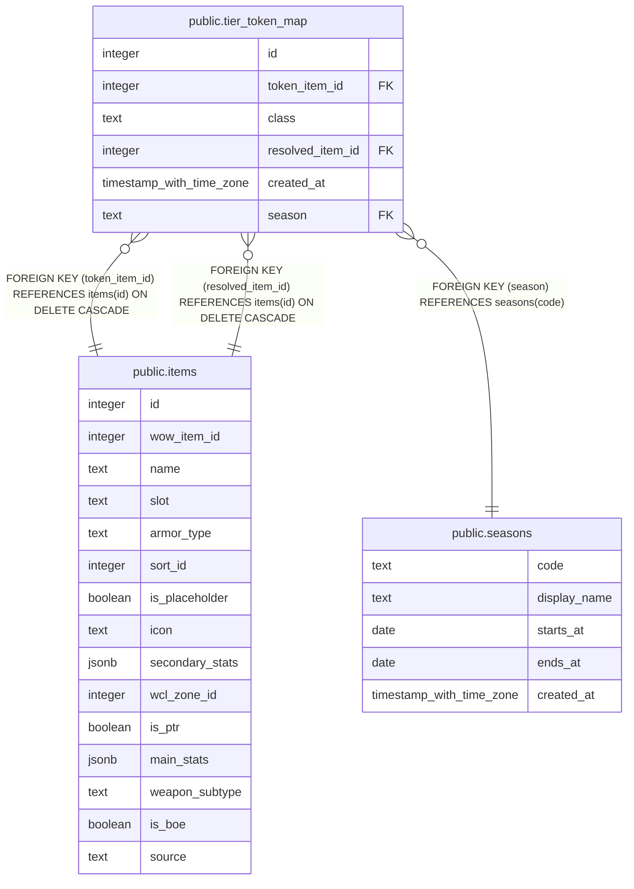

# public.tier_token_map

## Columns

| Name | Type | Default | Nullable | Children | Parents | Comment |
| ---- | ---- | ------- | -------- | -------- | ------- | ------- |
| id | integer | nextval('tier_token_map_id_seq'::regclass) | false |  |  |  |
| token_item_id | integer |  | false |  | [public.items](public.items.md) |  |
| class | text |  | false |  |  |  |
| resolved_item_id | integer |  | false |  | [public.items](public.items.md) |  |
| created_at | timestamp with time zone | now() | false |  |  |  |
| season | text |  | false |  | [public.seasons](public.seasons.md) | Season code (MID2) this token mapping belongs to (#1108). Readers filter on the current season; #932 adds the foreign key to seasons(code). |

## Constraints

| Name | Type | Definition |
| ---- | ---- | ---------- |
| tier_token_map_resolved_item_id_fkey | FOREIGN KEY | FOREIGN KEY (resolved_item_id) REFERENCES items(id) ON DELETE CASCADE |
| tier_token_map_token_item_id_fkey | FOREIGN KEY | FOREIGN KEY (token_item_id) REFERENCES items(id) ON DELETE CASCADE |
| tier_token_map_pkey | PRIMARY KEY | PRIMARY KEY (id) |
| tier_token_map_season_fkey | FOREIGN KEY | FOREIGN KEY (season) REFERENCES seasons(code) |

## Indexes

| Name | Definition |
| ---- | ---------- |
| tier_token_map_pkey | CREATE UNIQUE INDEX tier_token_map_pkey ON public.tier_token_map USING btree (id) |
| tier_token_map_resolved_item_key | CREATE UNIQUE INDEX tier_token_map_resolved_item_key ON public.tier_token_map USING btree (resolved_item_id) |
| tier_token_map_season_token_class_key | CREATE UNIQUE INDEX tier_token_map_season_token_class_key ON public.tier_token_map USING btree (season, token_item_id, class) |

## Relations

---

> Generated by [tbls](https://github.com/k1LoW/tbls)
