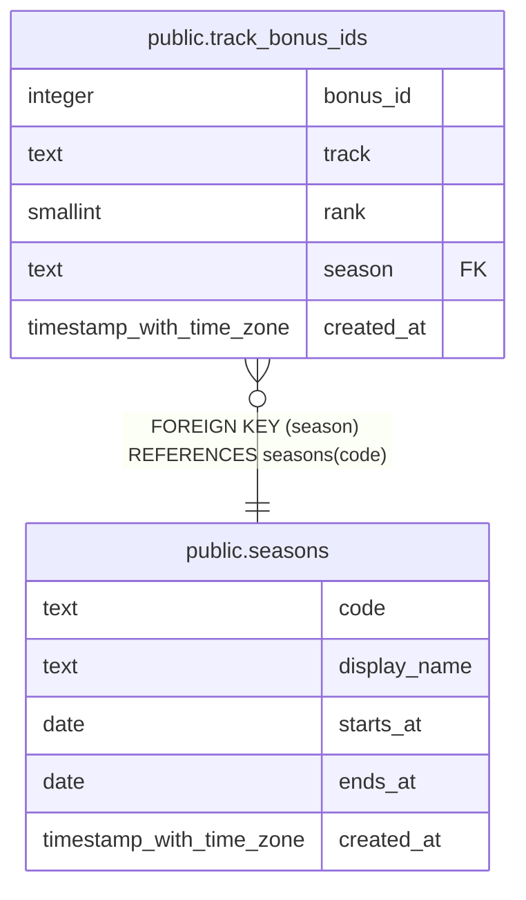

# public.track_bonus_ids

## Description

Maps a WoW item bonus ID to its gear upgrade track and rank (e.g. 12853 -> Myth 5/6). Read by blizzard-gear-sync when syncing equipped gear, and the intended future home of the constants currently inlined in import_rclc_loot(). Seeded by hand per tier -- append the new block, never edit or delete old rows, since older gear keeps its original bonus IDs.

## Columns

| Name | Type | Default | Nullable | Children | Parents | Comment |
| ---- | ---- | ------- | -------- | -------- | ------- | ------- |
| bonus_id | integer |  | false |  |  |  |
| track | text |  | false |  |  |  |
| rank | smallint |  | false |  |  |  |
| season | text |  | false |  | [public.seasons](public.seasons.md) | Provenance only -- which tier this block was allocated for. Lookups deliberately ignore it; Blizzard issues a fresh ID block each tier so rows cannot collide across seasons. |
| created_at | timestamp with time zone | now() | false |  |  |  |

## Constraints

| Name | Type | Definition |
| ---- | ---- | ---------- |
| track_bonus_ids_pkey | PRIMARY KEY | PRIMARY KEY (bonus_id) |
| track_bonus_ids_season_fkey | FOREIGN KEY | FOREIGN KEY (season) REFERENCES seasons(code) |

## Indexes

| Name | Definition |
| ---- | ---------- |
| track_bonus_ids_pkey | CREATE UNIQUE INDEX track_bonus_ids_pkey ON public.track_bonus_ids USING btree (bonus_id) |

## Relations

---

> Generated by [tbls](https://github.com/k1LoW/tbls)
